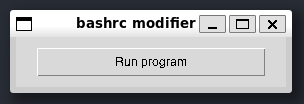

# bashrc_modifiers
Open the .bashrc file on Sublime Text with 1 click

# Why use this app?
This app allows the user to open the .bashrc file safely without having to manualy navigate from the file explorer to open linux files or using rm or mv ~/.bahrc, avoiding this way accidental moving, deletion.

## Installation
- Download the file from the `bin` folder
- Install [Sublime Text](https://www.sublimetext.com/docs/linux_repositories.html#apt)

## Usage
- Open the app

- Click the button to open and modify .bashrc
- When you finish close the file and program

If you want to use something sorter than `source ~/.bashrc` open `wsl` and type:

```bash
echo "alias sb='source ~/.bashrc'" >> ~/.bashrc && source ~/.bashrc
```

This way if you have the wsl terminal open you can reload it to see changes from a modified .`bashrc` by simply typing `sb`

